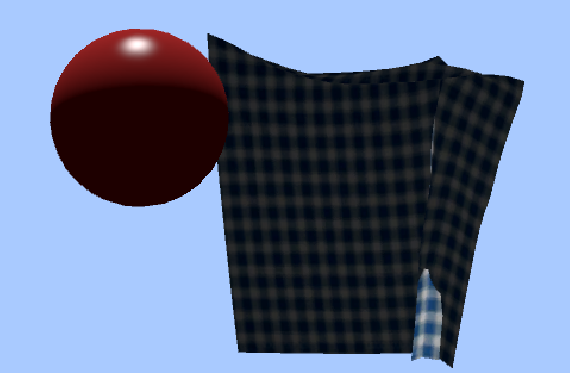

# ComputerGraphics-GAMES103

Thanks for GAMES platform, which let Chinese native speakers learn Computer Graphics easier.

[games-cn.org](https://games-cn.org/)

This is my solutions for assignments of GAMES103.

### Assignments

pay attension to that in the `assignment${i}` dictory, the unitypackage file with prefix `sszp` is my work, while the other one is the origin environment file

- first assignment: rigid bunny

> path: `./assignments/assignment1/sszp_rigid_bunny.unitypackage`

> when implement, pay attension to:
> 
> - how to eliminate sliding effect.
> 
> - how to do impluse method to a rigid body.
> 
> - how to do penalty method to a particle of the rigid body in shape matching.

- second assignment: cloth

> path: `./assignments/assignment2/sszp_cloth.unitypackage`

> when implement, pay attension to:
> 
> - how the edges are constructed.
> 
> - how to calculate the gradient of a vertex and apply to its velocity updating.
> 
> - how to fix some vertex so that its position doesn't change (when you fix some vertices you'll easily to notice that the cloth easily intersect with itself).
> 
> > 
> 
> - how to implement the chebyshev acceleration.
> 
> - how to use projection function to do strain limit to correct the mesh.

- third assignment: house

> path: ./assignment/assignement3/sszp_house.unitypackage

> - how to build the edge matrix (the order of vertices matters).
> 
> - how to build Deformation Gradient by inverse edge matrix of reference state and edge matrix of deformation state.
> 
> - how to build the second Piola-Kirchhoff stress S and then get the first Piola-Kirchhoff stress P (P = FS)
> 
> - why we can use SVD for isotropic materials to get First Piola-Kirchhoff stress P (P = FS)

- fourth assignment: wave

> path: ./assignment/assignment4/sszp_wave.unitypackage

> - how to dedude the simplified shallow wave equation without variant u, but only height h and pressure p (while p is also a function of h).
> 
> - how to implement two-way coupling (liquid->solid, solid->liquid).
> 
> - how to get the displaced volume of a cube, when cube is rotated.
> 
> - how to solve the linear equation of virtual height and bi (by conjugate gradient)
> 
> - how to define the integer index bounding box of a cube so that we don't need to scan over the whole mesh to determine whether the cube intersect with the current cell.
